# Vaccination Tracker

This application stores the vaccination history of the user and displays what vaccinations are recommended for when a person travels to a particular country. Once the user has selected the country they wish to travel, a list shows of the vaccinations recommended and the user is able to select add to cart and it adds the vaccination to their profile page in a shopping list. Once the user has been vaccinated, the vaccination moves to the protected list and shows the user when they are due for a booster.

## Contents

The application consists of 1 main file, server.js. The config folder contains the middleware file and the passport.js file. The db folder contains all the seed files for the tables. The models folder contains all the models needed for sequelize. The public folder contains all the Javascript files, html files and the css file.

## Usage

To use this application, git clone this repository. Once you have git cloned, run npm install to install the dependencies for the application which are:

- Express
- Passport
- Bcrypt
- Express sessions
- Mysql2
- Nodemon
- Sequelize
- Moment

The application can be invoked with npm start.

## User Story

AS A health conscious person 
I WANT something that can remember the vaccination dates 
SO THAT I don’t get sick 

AS A traveller 
I WANT something that tells me what vaccinations are needed for specific countries 
SO THAT I am able to travel safely

## Link to the application

https://project02-003.herokuapp.com/

## Screenshots

Screenshot1: This app firstly provides the log-in/sign-up landing page.

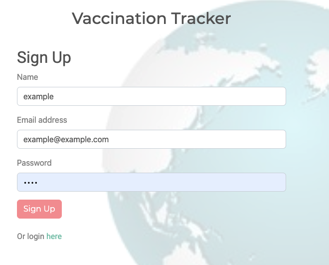

--------------

Screenshot2: Once logged in, the user can look for the vaccinations by either the name of the disease OR the destination he/she is looking to go.

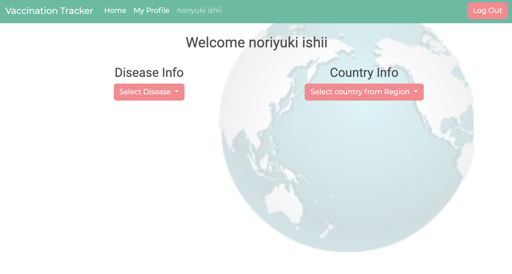

--------------

Screenshot3: "Select Disease" option offers the list of major diseases that requires vaccination.

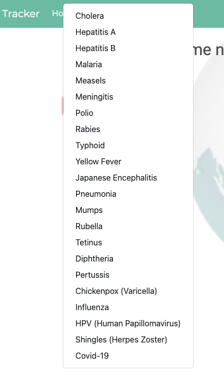

--------------

Screenshot4: each page offers the description of the disease. The user can click the Add-To-Cart button if he/she wishes to add to the shopping list. 

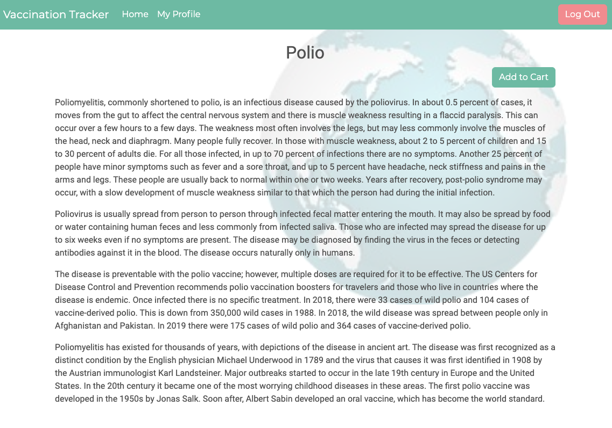

--------------

Screenshot5: Once clicked, the UI offers the user the confirmation. 

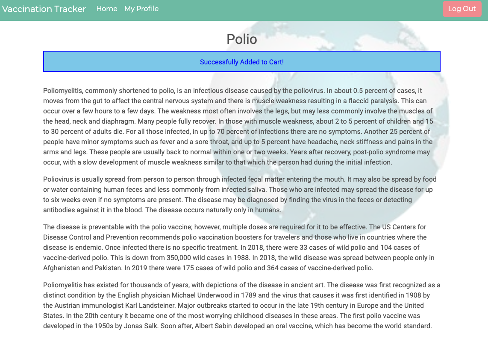

--------------

Screenshot6 and 7: The country button offers the region first, then the list of countries.  

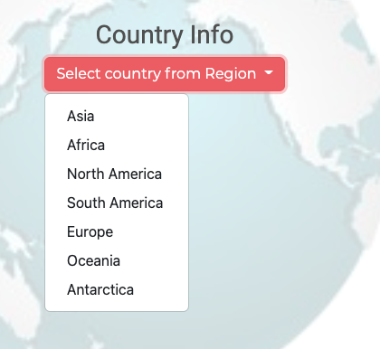
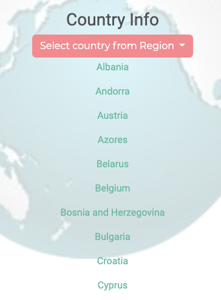

--------------

Screenshot 8: Each country page offers the user the list of vaccinations recommended for all, most and some travellers with the add-to-cart button for each disease. 

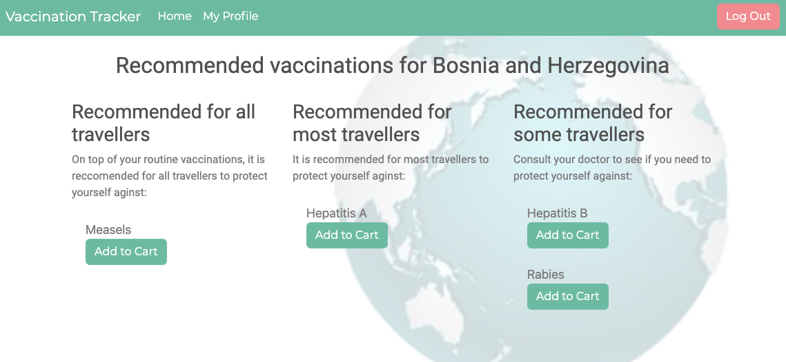

--------------

Screenshot 9: Similar to the disease page, the user can add the vaccination from this page as well. 

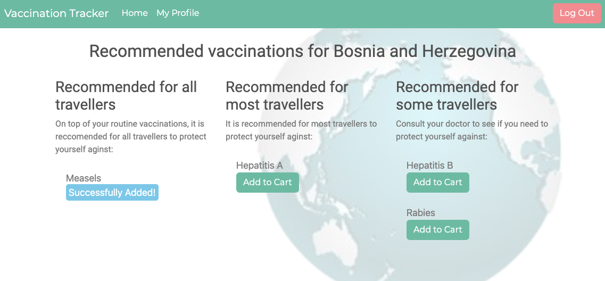

--------------

Screenshot 10: In the My Profile page, the user can see the shopping list with the Delete and Vaccinate buttons. 

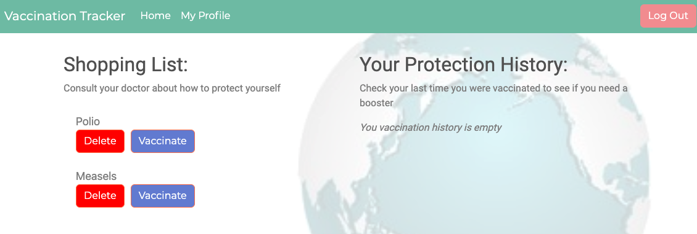

--------------

Screenshot 11: Once the vaccination button is clicked, the protection history updates itself with the month and year of the vaccination.

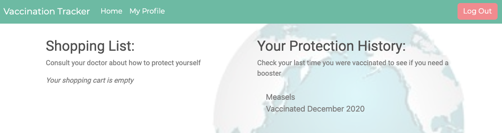

## Built With

- VS Code - (https://code.visualstudio.com/)
- Terminal
- Express
- Node
- Sequelize
- GIMP 2.10

## License

MIT License
Copyright (c) 2020 ManNeu

Permission is hereby granted, free of charge, to any person obtaining a copy
of this software and associated documentation files (the "Software"), to deal
in the Software without restriction, including without limitation the rights
to use, copy, modify, merge, publish, distribute, sublicense, and/or sell
copies of the Software, and to permit persons to whom the Software is
furnished to do so, subject to the following conditions:

The above copyright notice and this permission notice shall be included in all
copies or substantial portions of the Software.

THE SOFTWARE IS PROVIDED "AS IS", WITHOUT WARRANTY OF ANY KIND, EXPRESS OR
IMPLIED, INCLUDING BUT NOT LIMITED TO THE WARRANTIES OF MERCHANTABILITY,
FITNESS FOR A PARTICULAR PURPOSE AND NONINFRINGEMENT. IN NO EVENT SHALL THE
AUTHORS OR COPYRIGHT HOLDERS BE LIABLE FOR ANY CLAIM, DAMAGES OR OTHER
LIABILITY, WHETHER IN AN ACTION OF CONTRACT, TORT OR OTHERWISE, ARISING FROM,
OUT OF OR IN CONNECTION WITH THE SOFTWARE OR THE USE OR OTHER DEALINGS IN THE
SOFTWARE.

## Authors

Chloe Blackwell 
Email: chloeblackwell2@hotmail.com 
Github: https://github.com/chloeblackwell

Noriyuki Ishii  
Email: nishii.dev.syd@gmail.com 
GitHub: https://github.com/noriyuki-ishii-820

Manish Neupane  
Email: mrnish.are@gmail.com  
Github: https://github.com/ManNeu

Luke Wilkinson  
Email: luke.wilkinson.nz@gmail.com 
GitHub: https://github.com/DukeWilki
